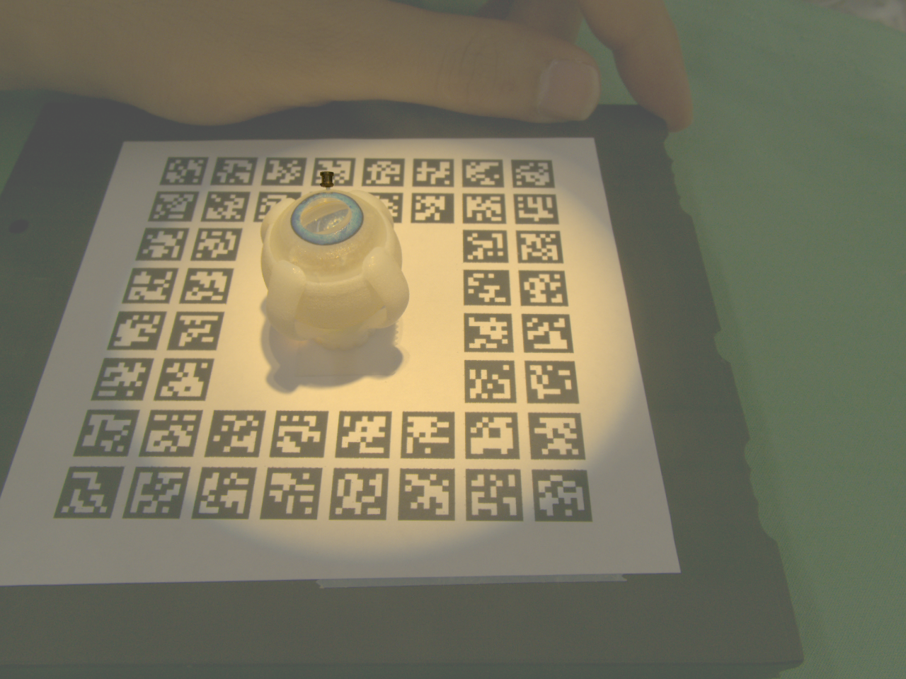
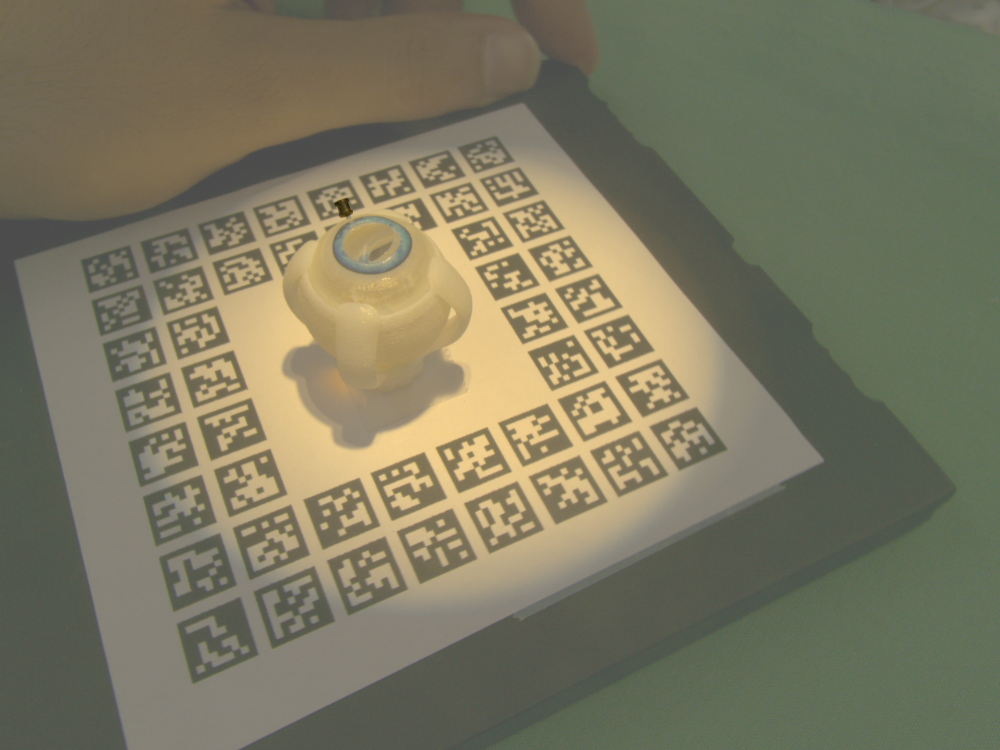
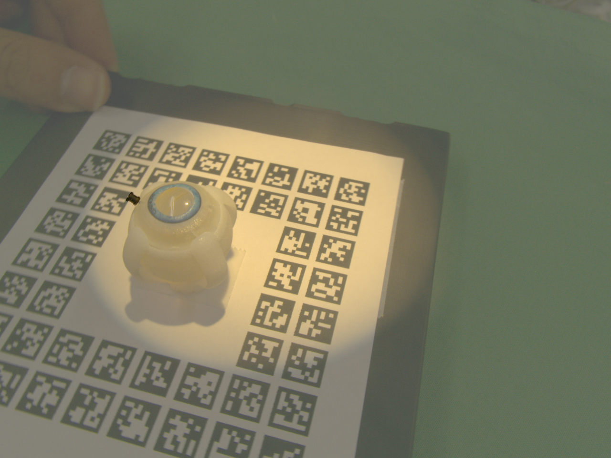
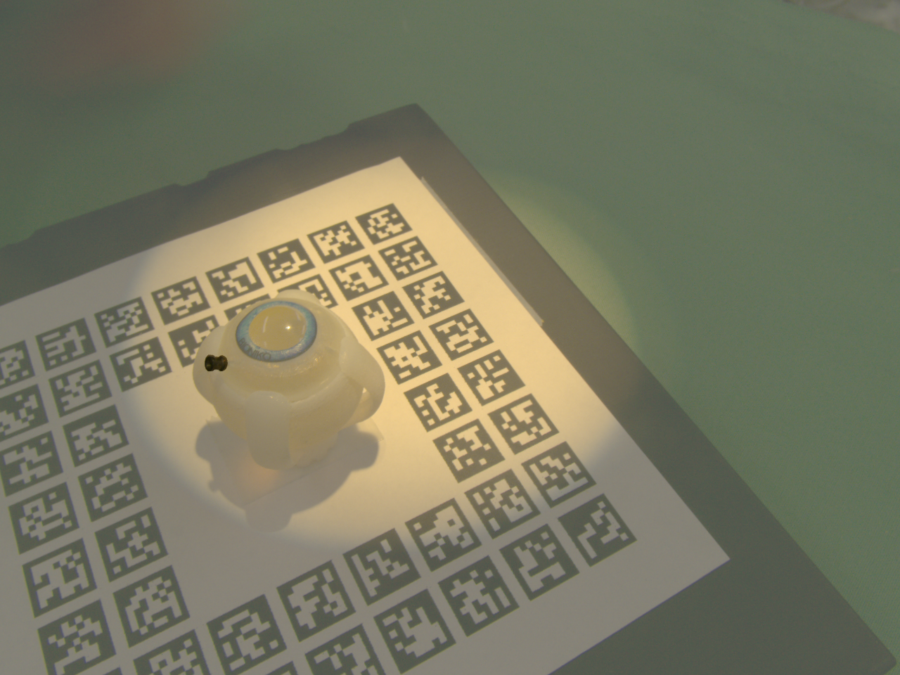
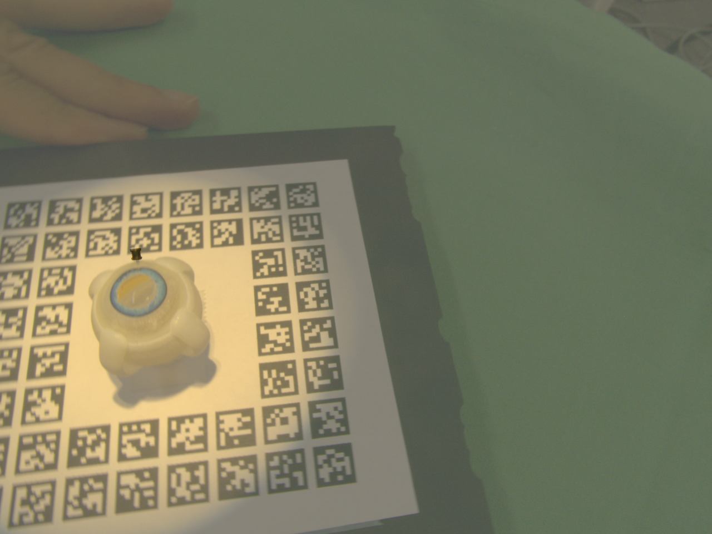
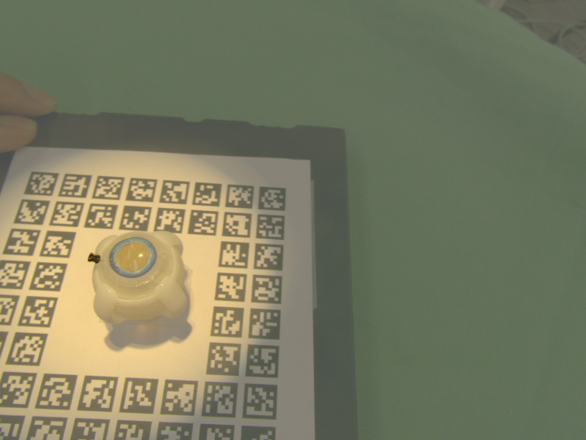
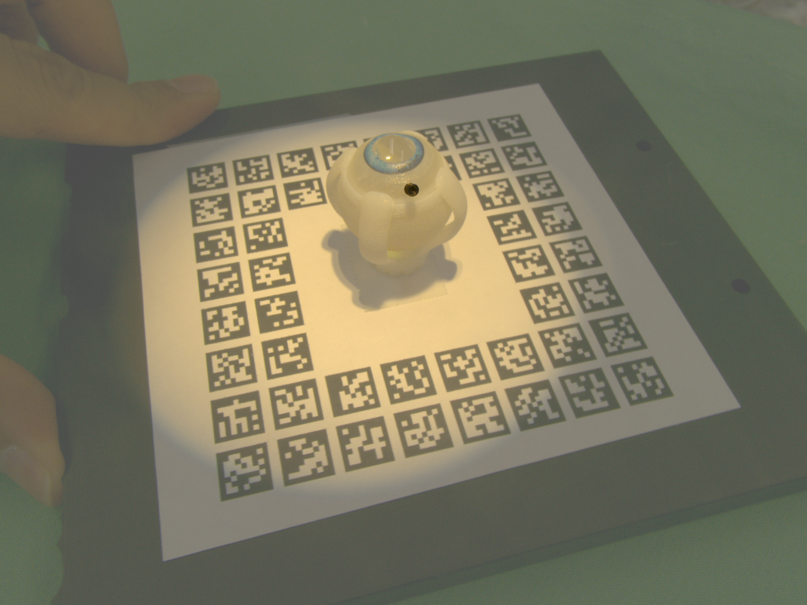
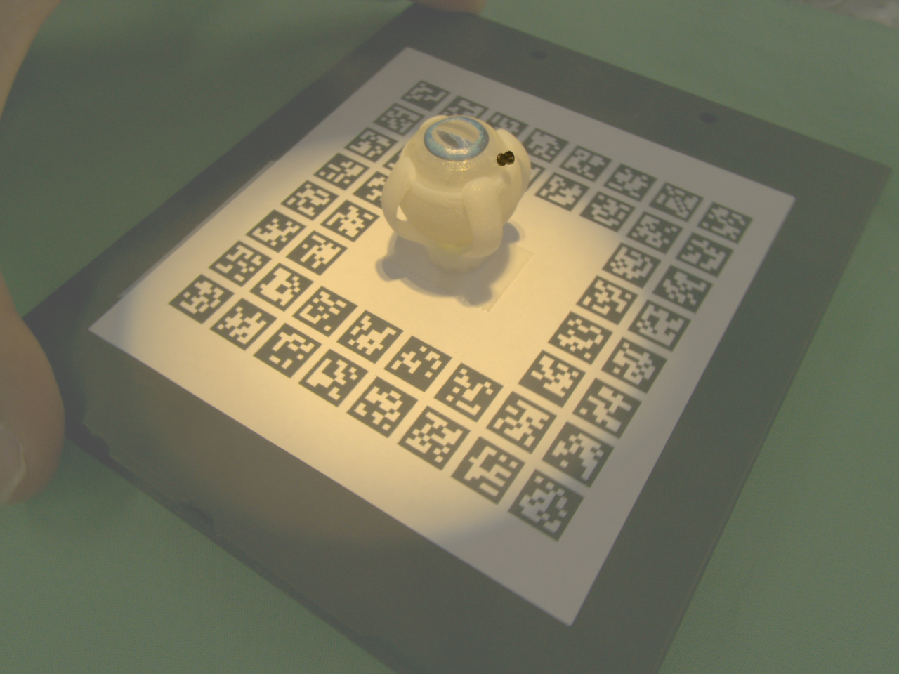
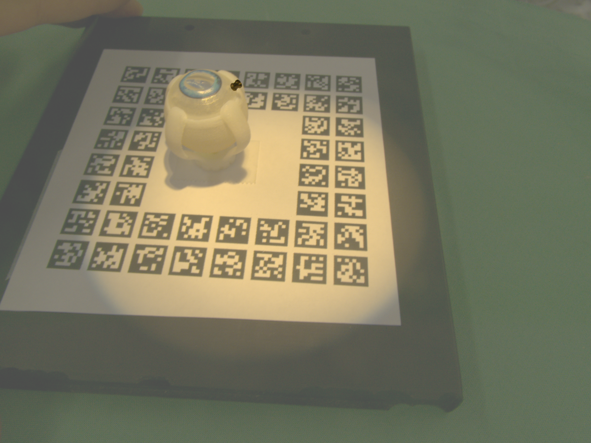
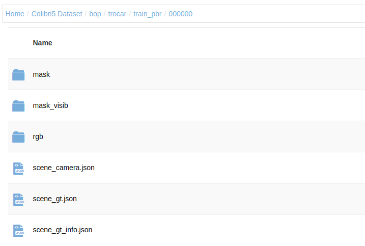

# 5-DoF Trocar Pose Dataset

## Intro

In this repository, the nesccary codes are provided to either create a 6DoF pose dataset from scratch an convert them into conventional dataset types (BOP and COCO), or to use the trocar pose dataset.

## Creating Fake Dataset
This code generates the desired amount of images of a `CAD` file with a pose in a defined range, with a random background from VOC dataset. This is usually helpful for pretrianing of the models.

## Annotating Real Dataset
The code receives a folder with the images of the desired object, attached to an aruco board. One frame among those images should be chosen to be used to caluclate the initail pose, by changing the values in `utils.ObjectToTrack`. A point on the object should be clicked to see a crop, and then the correspondance points to `utils.ObjectToTrack.original_points` should be selected one by one, with pressing <kbd>Q</kbd> in between. When this step is done, the pose could be refined by looking through three different views with keyboard. The keyboard mappings are as follows:

* <kbd>←</kbd> - X/Y
* <kbd>→</kbd> + X/Y
* <kbd>s</kbd> Switch between X and Y
* <kbd>→</kbd> + Z
* <kbd>↓</kbd> - Z
---
* <kbd>X</kbd> X Rotation
* <kbd>Y</kbd> Y Rotation
* <kbd>Z</kbd> Z Rotation
* <kbd>1</kbd> Switch X rotation direction
* <kbd>2</kbd> Switch Y rotation direction
* <kbd>3</kbd> Switch Z rotation direction
---

* <kbd>Space</kbd>: Approve

When the pose is approved, all the images are processed and converted into an intermediate `.npz` format.

## Export
By using `convert_to_bop.py` and `convert_to_coco.py`, the intermediate `npz` format is converted into the standard dataset.

## Notes
* This repo only support scenes with one object inside.

------
## Dataset Access

The dataset is uploaded [https://syncandshare.lrz.de/getlink/fiGiJsDAyB2aY1yXVgmfpd/][here]. To receive the password, please write an email to `shervin.dehghani@tum.de` with a short description of the research. The data is in `BOP` format. 

